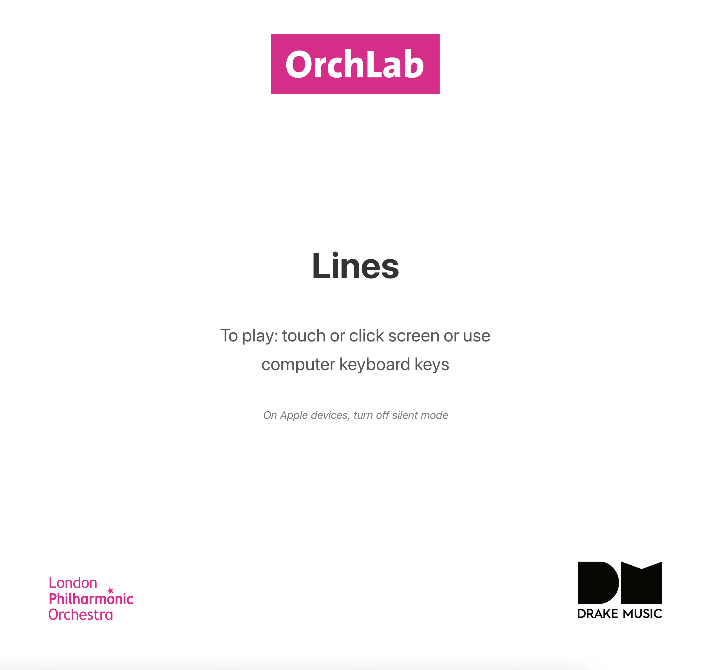
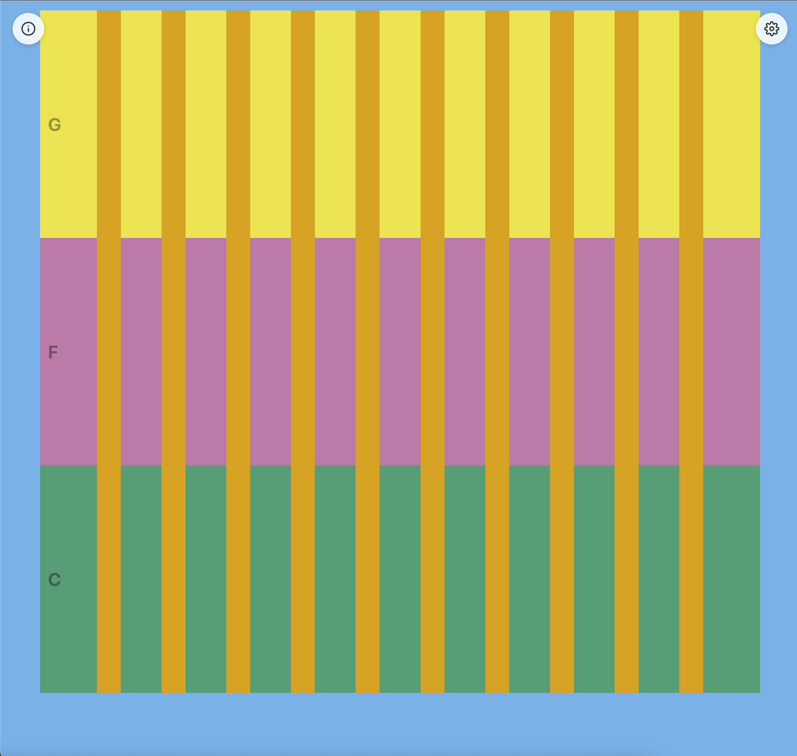
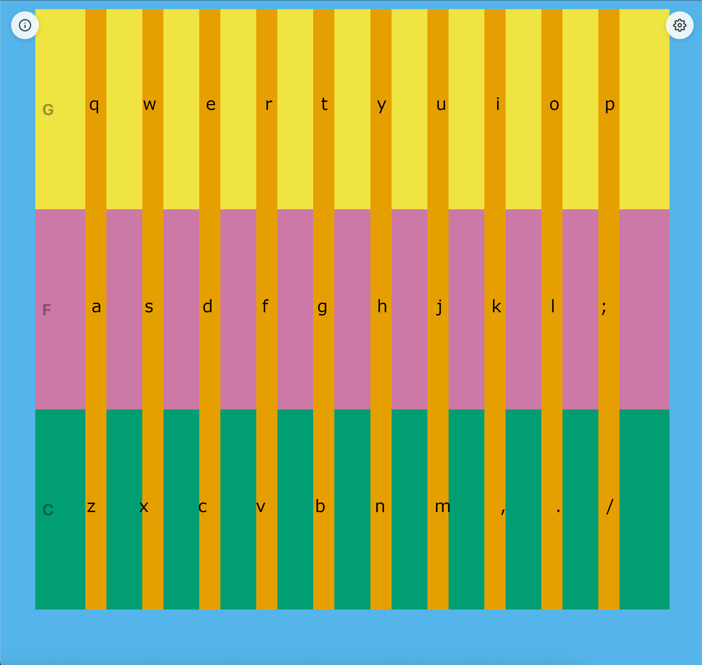
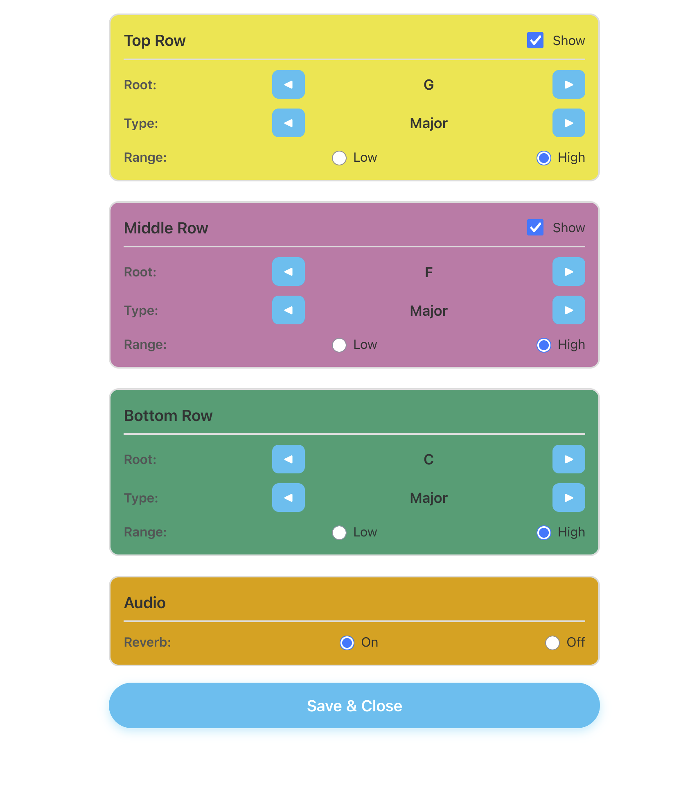
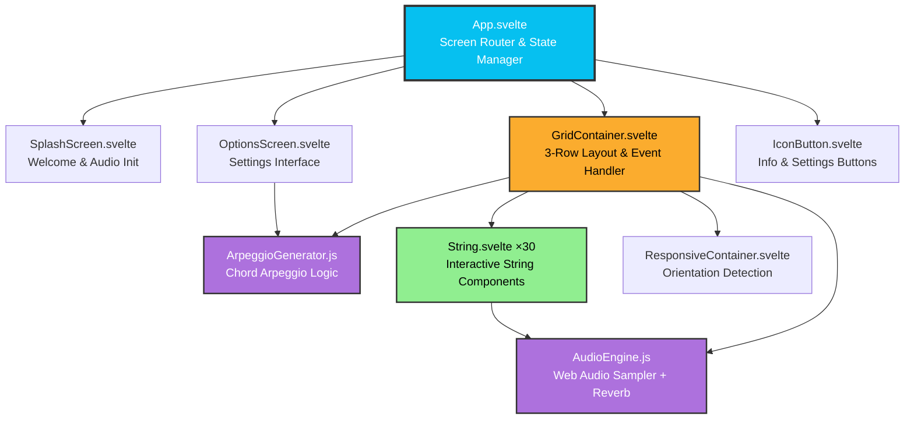

# Patterns - Harp-Style Touch Interface

A responsive web-based harp-like instrument that transforms your screen into playable vertical strings arranged in three colorful rows. Each string plays a note from a configurable chord arpeggio, creating an intuitive and accessible way to make music through touch, mouse, or keyboard.

## Features

- **Chord-Based Arpeggios**: Choose from Major, Minor, Dom7, Maj7, and Min7 chord types
- **12 Root Notes**: Play in any key from C to B
- **Configurable Rows**: Each of the three rows can be independently configured with different chords
- **Two Octave Ranges**: Select low (octave 2) or high (octave 3) range for each row
- **Row Visibility**: Toggle the top and middle rows on/off to create 2-row or 3-row layouts
- **Reverb Effect**: Built-in reverb that can be toggled on/off
- **Responsive Design**: Adapts seamlessly to portrait and landscape orientations
- **Multiple Input Methods**:
  - Touch/tap on mobile devices
  - Mouse clicks and drag/strum on desktop
  - Full QWERTY keyboard support (30 keys for 30 strings)
- **iOS 12+ Compatible**: Extensively tested and optimized for older iOS devices
- **Persistent Settings**: Your chord, key, octave, and reverb preferences are saved locally

## Usage

### 1. **Launch**: Click/tap anywhere on the splash screen to begin or press any key on the keyboard.



### 2. **Play**: 
   - Touch or click individual strings to play notes
   - Drag across strings to strum
   - Use QWERTY keyboard keys for the 30 strings (3 rows of 10)
   - Press 'Escape' key for panic stop (stops all notes)




*Keyboard mapping for the 30 strings across three rows*

**Keyboard Layout:**
- **Top Row**: Q W E R T Y U I O P
- **Middle Row**: A S D F G H J K L ;
- **Bottom Row**: Z X C V B N M , . /

### 3. **Configure**: 
   - Tap the settings icon (⚙️) to customize each row's chord, root note, and octave range
   - Toggle row visibility to create different layouts
   - Enable or disable reverb effect
   - Tap the info icon (ℹ️) to view instructions again



## How It Works

The app uses the Web Audio API to play a sampled harp note pitch-shifted in real-time. Each string corresponds to a note in a chord arpeggio, arranged from low to high across each row.

**Audio Engine**: Employs a sampler-based approach with a single harp sample (C4) that is pitch-shifted to generate all notes. Includes a custom reverb effect built from multiple delay patterns.

**Arpeggio Generation**: Dynamically generates 10-note arpeggios for each row based on the selected root note, chord type, and starting octave. The arpeggio cycles through chord tones across multiple octaves.

## Development

### Prerequisites

- Node.js (v14 or higher)
- npm or pnpm

### Installation

```bash
# Clone the repository
git clone https://github.com/gawainhewitt/soundmakers_patterns.git
cd soundmakers_patterns

# Install dependencies
npm install

# Start development server
npm run dev
```

Visit `http://localhost:5173` in your browser.

### Building for Production

```bash
# Build the app
npm run build

# Preview the production build
npm run preview
```

The built files will be in the `dist/` directory, ready for deployment.

### Testing on Mobile Devices

To test the production build on physical mobile devices (especially useful for iOS testing):

```bash
# Build the app first
npm run build

# Serve the production build on your local network
npm run serve
```

The app will be available at your local IP address (e.g., `http://192.168.1.x:3000`). You can access this URL from any device on the same network.

**Note**: This is particularly important for testing iOS-specific features like audio initialization and touch handling, which behave differently in development vs production builds.

## iOS Compatibility Notes

This app has been carefully optimized for iOS 12+ devices:

- **Polyfills**: Core-js and regenerator-runtime ensure ES6+ features work on older browsers
- **Audio Unlocking**: Implements iOS-specific audio context initialization on user interaction
- **Touch Handling**: Advanced touch tracking with global touch move detection for smooth strumming
- **Sample-Based Audio**: Uses Web Audio API with pitch-shifting for better performance than synthesizers on older devices
- **Viewport Management**: Comprehensive fixes for iOS viewport issues when switching apps
- **Zoom Prevention**: Disables pinch-zoom and double-tap-zoom for a native app feel
- **Optimized Audio**: 96 kbps mono audio file for improved loading and playback on older hardware

## Project Structure

```
├── src/
│   ├── App.svelte              # Main app component & screen routing
│   ├── main.js                 # Entry point with iOS fixes
│   ├── app.css                 # Global styles
│   └── lib/
│       ├── AudioEngine.js      # Web Audio API sampler with reverb
│       ├── String.svelte       # Individual playable string component
│       ├── GridContainer.svelte # 3-row layout & event handling
│       ├── OptionsScreen.svelte # Settings interface
│       ├── ArpeggioGenerator.js # Musical arpeggio generation logic
│       ├── SplashScreen.svelte # Welcome/instructions screen
│       ├── IconButton.svelte   # Reusable icon button component
│       ├── ResponsiveContainer.svelte # Orientation handling
│       └── ScaleGenerator.js   # (Legacy - not used in current version)
├── public/
│   ├── images/                 # Logos and icons
│   ├── sounds/                 # Harp sample audio file
│   └── polyfills/              # iOS 12+ compatibility scripts
└── index.html                  # Entry HTML with polyfill loading
```

## Architecture



*Component hierarchy and data flow*

## Technologies Used

- **Svelte 5**: Modern, reactive UI framework
- **Vite**: Fast build tool and dev server
- **Web Audio API**: Real-time audio playback and processing
- **Vite Legacy Plugin**: Automatic transpilation and polyfills for older browsers

### Design Decisions

**Static Site Delivery**: This app is built as a static site (vanilla Vite + Svelte) rather than using SvelteKit. This architectural choice provides:

- **Maximum Compatibility**: Works seamlessly on older devices and browsers (iOS 12+)
- **Lightweight Bundle**: Minimal JavaScript footprint for faster loading on slower devices
- **Simple Deployment**: Can be deployed to any static hosting service without server-side requirements
- **Reduced Complexity**: No SSR overhead or routing complexity for a single-page application

**Sampler-Based Audio**: The app uses a single harp sample (C4) and pitch-shifts it in real-time rather than using oscillator-based synthesis or loading 30 separate samples. This approach:

- **Reduces Memory Usage**: Only one audio file needs to be loaded
- **Faster Initial Load**: Significantly reduces network transfer time
- **Better iOS 12 Performance**: Simpler audio graph performs better on older devices
- **Authentic Timbre**: Maintains the natural harp sound quality across all pitches

**Time-Based Retrigger Prevention**: Strings use time-based checks rather than boolean flags to prevent rapid retriggering, allowing smooth strumming while avoiding audio buildup.

This approach prioritizes accessibility and performance, ensuring the app works reliably across the widest possible range of devices and network conditions.

## Troubleshooting

**No sound on iOS**: Ensure silent mode is turned off. The audio context requires an initial user interaction (handled by the splash screen).

**Stuck notes**: Press the 'Escape' key to trigger panic stop, or use the window blur detection which automatically stops all notes when switching apps.

**Layout issues after app switching**: The app includes comprehensive viewport reset logic that should handle this automatically.

**Strings not responding to strum**: Ensure you're dragging continuously. The app tracks touch/mouse movement globally and triggers strings as your pointer crosses them.

## Contributing

Contributions are welcome! Please feel free to submit a Pull Request.

## License

See [LICENSE](LICENSE) file for details.

## Credits

Developed in collaboration with:
- [**OrchLab**](https://orchlab.org/)
- [**London Philharmonic Orchestra (LPO)**](https://lpo.org.uk/)
- [**Drake Music**](https://www.drakemusic.org/)
- [**Gawain Hewitt**](https://gawainhewitt.co.uk/)
